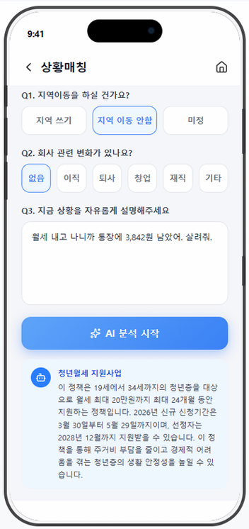

# 청년 지원 정책 맞춤 추천 AI 서비스 (HAPP:ME)


> **4인 팀 프로젝트** · 2026.06 – 2026.08 · IBM x Red Hat AI Transformation 과정
>
> 팀 저장소 3개([bene_ai](https://github.com/PARKJAEKYUNG0525/bene_ai), [bene_backend](https://github.com/PARKJAEKYUNG0525/bene_backend), [bene_frontend](https://github.com/PARKJAEKYUNG0525/bene_frontend))를
> **커밋 이력과 작성자를 그대로 유지한 채** 하나로 합친 포트폴리오용 저장소입니다.

사용자의 나이·지역·상황을 바탕으로 신청할 수 있는 청년 지원 정책을 찾아 줍니다.
온통청년, 중앙부처·지자체 복지서비스(공공데이터포털) 정책 약 4,000건을 하나의 데이터로 통합하고,
**Rule 엔진 → 임베딩 유사도 검색 → LLM 선택·설명** 3단계로 추천합니다.

## 화면

<table>
  <tr>
    <td align="center"></td>
    <td align="center"></td>
    <td align="center"></td>
  </tr>
  <tr>
    <td align="center"><b>홈</b><br>지원금액 높은 정책 배너와 서비스 메뉴</td>
    <td align="center"><b>상황매칭</b><br>상황을 자유롭게 적으면 AI가 정책 1개를 골라 이유를 설명</td>
    <td align="center"><b>공고문 사진 분석</b><br>현수막·포스터 사진을 올리면 관련 정책을 찾아 매칭도 표시</td>
  </tr>
</table>

<sub>서비스는 프로젝트 기간 이후 배포를 종료했습니다.</sub>

## 추천 흐름

```
사용자 프로필 · 상황 입력 ("복직 후 아이 돌봄 지원이 필요해요")
   │
   ▼
① Rule 엔진        나이 · 지역 · 소득 · 마감일로 신청 자격이 있는 정책만 남김
   │
   ▼
② 임베딩 검색      정책별 "검색 문서"와 상황을 BAAI/bge-m3로 비교해 상위 10개 후보
   │
   ▼
③ LLM 선택 · 설명  watsonx.ai(Mistral Small 24B)가 후보 중 1개를 고르고,
                   정책 정보에 있는 내용만 근거로 추천 이유를 작성
```

**검색 문서(Search Document):** 정책 원문은 법률·행정 문구 위주라, 그대로 임베딩하면 사용자 질문과 잘 맞지 않았습니다.
그래서 정책마다 "누가, 어떤 상황에서 받을 수 있는지" 중심의 검색용 문서를 LLM으로 따로 만들어 임베딩했습니다.

## 저장소 구조

| 폴더 | 원본 저장소 | 내용 | 주요 기술 |
| --- | --- | --- | --- |
| `ai/` | bene_ai | 정책 추천(Rule 엔진·유사도 검색·LLM), 검색 문서·요약 생성, PDF·웹 정책 요약, 이미지 OCR 분석, 성능 평가 | FastAPI, sentence-transformers(bge-m3), IBM watsonx.ai, PaddleOCR, YOLO(ultralytics), PyMuPDF, Playwright, Sentry |
| `backend/` | bene_backend | 정책 데이터 수집·통합, 회원·소셜 로그인, 사용자 프로필, 북마크·알림 API | FastAPI, SQLAlchemy, MySQL, JWT, Docker |
| `frontend/` | bene_frontend | 정책 목록·상세, 맞춤 추천, 프로필 입력 화면 | React 19, Vite, Tailwind CSS |

**배포:** GitHub Actions로 AI 서버는 EC2(SSH), 백엔드는 ECR → ECS, 프론트엔드는 S3 + CloudFront에 배포했습니다.

## 성능 평가

팀에서 추천 단계의 LLM 정책 선택을 사람이 정답을 단 97건으로 평가했습니다 (Ragas, 평가 설계: PARKJAEKYUNG).
파인튜닝 없이 정답과 정확히 일치한 비율이 75.3%(73/97)였습니다.
오답 24건 중 18건은 "맞는 정책이 없는데 하나를 고른" 경우, 6건은 맞는 정책이 있는데 다른 것을 고른 경우였습니다.
자세한 방법과 모델별 비교는 [`ai/evaluation/README_성능평가.md`](ai/evaluation/README_성능평가.md)에 있습니다.

## 내 담당 (박진웅 · 부팀장)

커밋 이력(2026-06-17 ~ 07-27) 기준으로 정리했습니다.

- **맞춤형 정책 추천 (7월 초):** 팀장이 6월에 만든 Rule 엔진 프로토타입을 바탕으로, 서비스용 Rule 엔진과 사용자 프로필 구조, 맞춤 추천 API를 구현. 신청 마감 정책 분리, 기본 프로필 분석 추가 (`ai/app/services/recommendation/`)
- **상황매칭 LLM 선택·설명 (7/22):** 유사도 상위 후보 중 LLM이 정책 1개를 고르고 추천 이유를 설명하는 단계 구현
- **검색 문서 (6월 말):** watsonx.ai로 정책별 검색용 문서 762개를 생성해 임베딩 검색에 사용
- **정책 최신화 파이프라인 (7/16~23):** 관리자가 최신 정책을 수집하면, 새 정책의 요약·검색 문서·임베딩을 AI 서버에서 자동으로 다시 만드는 단계 구현 (수집 체인은 팀장)
- **S3 데이터·모델 배포:** 큰 데이터·모델 파일을 S3에 두고 서버 시작 시 내려받는 구조
- **정책 데이터 통합:** 출처별 정책 데이터를 공통 스키마로 통합, 지원금액 정규식 추출, 지자체 지역코드 변환
- **모니터링 (7/21):** Sentry, 에러 발생 시 Slack 알림, 파이프라인 단계별 실행시간 로그
- **성능 개선 (7/22~27):** 캐시 미스 시 추천 응답이 19.3초 걸리던 문제를 단계별 실행시간 로그로 분석해, 96.7%가 지역 조건 확인의 반복 계산에서 나온 것을 찾아 서버 시작 시 1회 계산으로 바꿔 **0.62초로 단축(약 31배)**. 그 밖에 Rule 엔진 결과 재사용 캐시, 임베딩 재계산·모델 중복 로드·나이 계산 버그 수정
- **정책 목록·화면:** 마감임박순 정렬, 많이 찾는 정책, 목록 필터, 홈 배너, 정책 상세, 맞춤 추천 결과의 지역별 분류

## 팀

| 이름 | 역할 (커밋 이력 기준) |
| --- | --- |
| 박재경 (PARKJAEKYUNG) | 팀장 · 프론트·백엔드 초기 구조와 ERD, 배포, Rule 엔진 프로토타입, 즐겨찾기 캘린더(공고문 일정 추출), 지역 혜택, 알림, 관리자 사이트, 소득 계산, 성능 평가 |
| 박진웅 (jinwoong96) | 부팀장 · 맞춤형 추천(Rule 엔진·캐시·LLM 선택), 검색 문서, 정책 최신화 파이프라인, 데이터 통합, 모니터링 |
| 이재환 (jaehwan) | 회원가입·로그인, 구글·네이버·카카오 소셜 로그인, 공고문 사진 OCR 분석, EC2 자동 배포 |
| 김유민 (yumimnmn) | PDF 공고문 요약, 매칭 실패 시 후보 3개 제시, 즐겨찾기 지역·분류, 홈 화면 레이아웃 |

## 실행에 대하여

서비스는 프로젝트 기간 이후 배포를 종료했고, 당시 쓰던 DB와 S3도 남아 있지 않습니다.

- **다시 만들 수 있는 것:** 정책 데이터, 요약, 검색 문서, 임베딩. 각 API 키를 넣고 관리자 페이지에서 최신화를 실행하면
  정책 수집부터 요약·검색 문서·임베딩 생성까지 코드가 자동으로 다시 만듭니다.
- **다시 구할 수 없는 것:** 공고문 사진 분석에 쓰던 파인튜닝 탐지 모델(Faster R-CNN·YOLO) 가중치. 용량 문제로 Git 대신 S3에 두고
  서버 시작 시 내려받았는데(`ai/app/core/model_downloader.py`), 현재 남아 있지 않습니다.

단, 현재 코드는 AI 서버 시작 시 탐지 모델과 검색 문서 파일을 바로 읽기 때문에, 처음부터 다시 띄우려면
이 두 부분을 "파일이 없으면 비활성화하거나 빈 상태로 시작"하도록 바꿔야 합니다.

필요한 환경변수 이름은 각 폴더의 `.env.example`에 있습니다. 동작하는 화면은 위 [화면](#화면) 섹션을 참고해 주세요.
